# JobTrackr

JobTrackr is a smart job discovery and application tracking platform for students and fresh graduates.

The product helps users choose skills, target roles, and preferred locations, then generates safe external job-search links for platforms such as LinkedIn, JobStreet Indonesia, Glints, Karir.com, and Dealls.

JobTrackr does not scrape job boards, ingest real-time job listings, or automate job applications.

## Product Preview

The screenshots below are captured from the actual local running app using fictional demo data only.

### Home

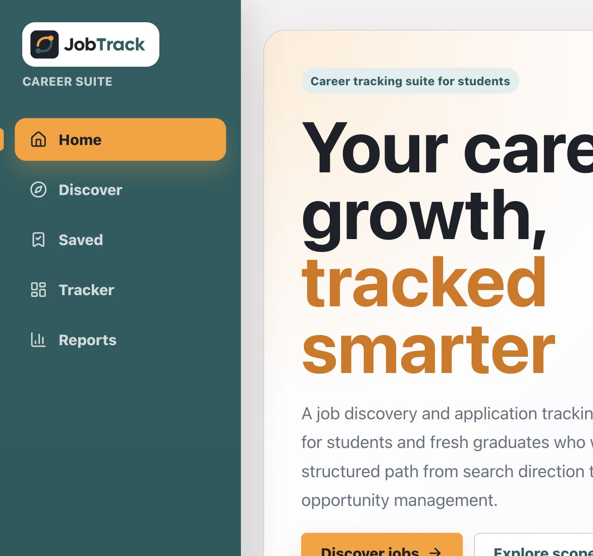

### Discover Jobs

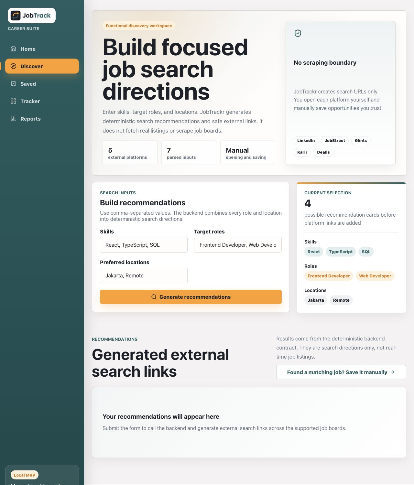

### Recommendation Results

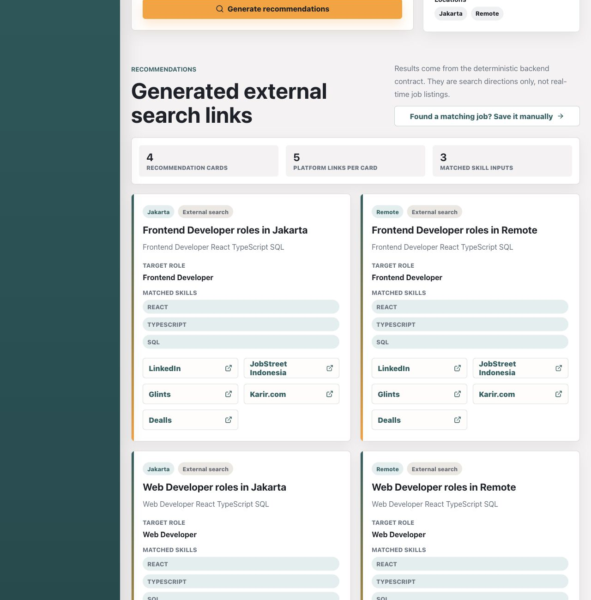

### Saved Opportunities

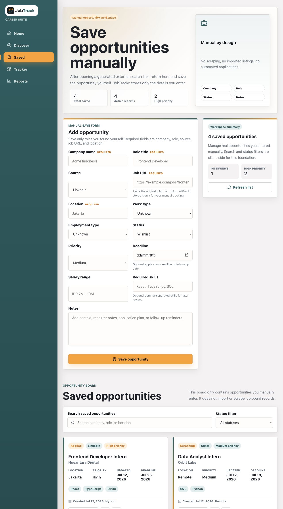

### Application Tracker

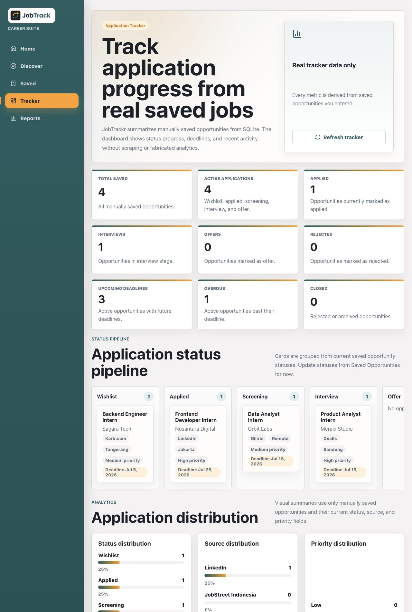

### Reports and HTML Report

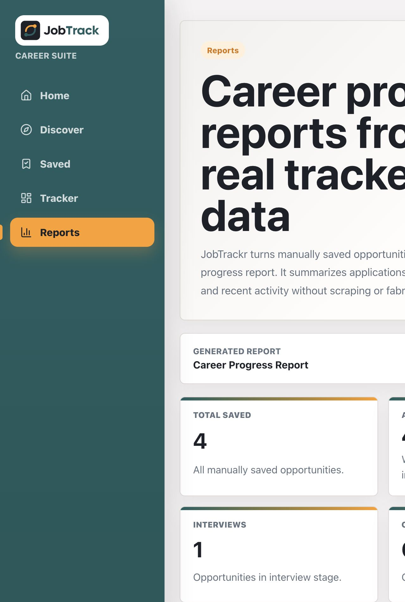

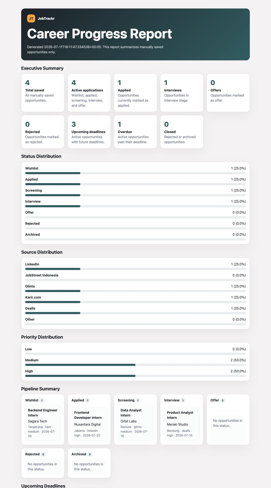

### Mobile Preview

| Home | Discover | Saved | Tracker |
| --- | --- | --- | --- |
| 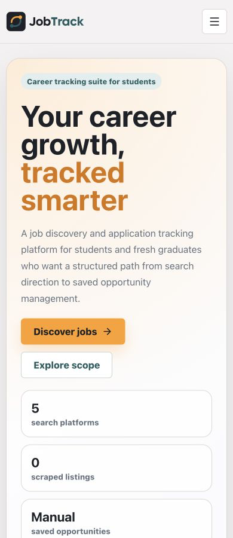 | 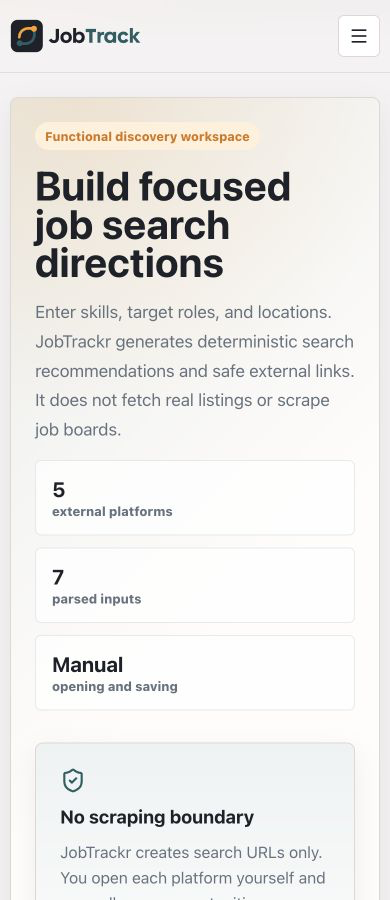 | 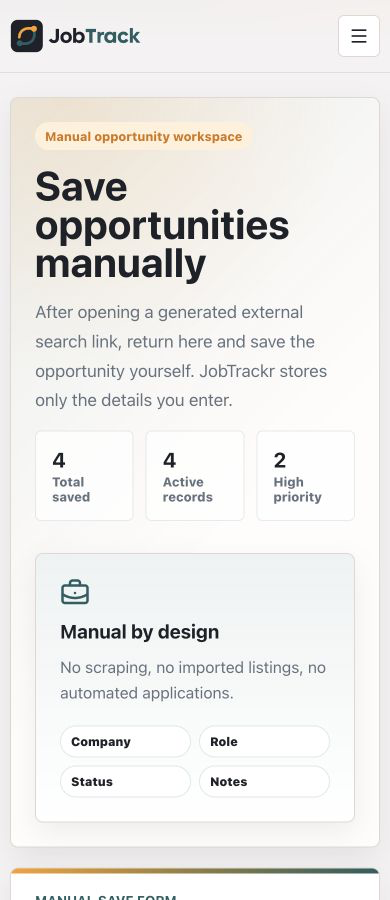 | 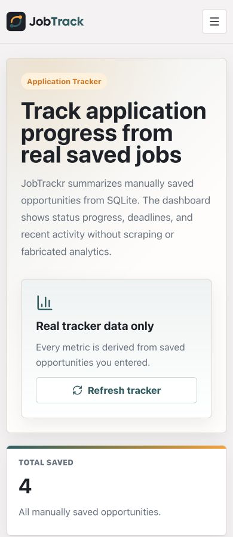 |

## Product Scope

JobTrackr is designed to help early-career candidates:

- Generate targeted search queries from selected skills, roles, and locations.
- Open those searches manually on trusted external job boards.
- Save interesting opportunities manually.
- Track job application progress through a professional dashboard.
- Generate career progress reports from saved opportunities and tracker analytics.

JobTrackr is not a scraper, not a job board clone, and not an automated application tool.

## JT-0001 Implementation

This foundation contract includes:

- FastAPI backend package with health check.
- Deterministic job search recommendation contracts.
- Recommendation API endpoint that generates safe external search URLs.
- React, TypeScript, and Vite frontend foundation.
- Backend and frontend tests.
- Product documentation and engineering decision log.

## JT-0002 Implementation

The frontend now includes a professional multi-page product UI:

- Original JobTrackr logo and navigation shell.
- Home page with hero, supported job boards, workflow, value cards, and credibility section.
- Functional Discover Jobs page connected to the backend recommendation endpoint.
- Polished future pages for Saved Opportunities, Application Tracker, and Reports.
- Brand system using `#FF9E20`, `#215E61`, `#1D2128`, and `#F4F2F2`.

The future pages are intentionally honest placeholders. They do not show fake saved jobs, fake application data, or fake reports.

## JT-0003 Implementation

Saved Opportunities is now the first real tracker feature:

- SQLite-backed local persistence under `backend/data/jobtrackr.sqlite3`.
- CRUD API for manually saved opportunities.
- Functional Saved Opportunities page with manual save form.
- Saved opportunity list with source/status badges, search, status filter, edit status/notes, and delete action.
- Discover Jobs CTA that guides users to save matching jobs manually.

Saved opportunities are user-entered records only. JobTrackr still does not scrape job boards or import third-party listings.

## JT-0004 Implementation

The frontend now follows the Stitch-inspired SaaS career suite direction:

- Redesigned app shell with desktop sidebar, stronger active states, and responsive navigation.
- Denser Home page with product mockup, workflow preview, supported boards, feature matrix, and trust boundaries.
- Redesigned Discover Jobs workspace with input builder, parsed selection chips, result summary, and polished recommendation cards.
- Redesigned Saved Opportunities workspace with metrics, manual-entry form, status/source cards, filters, edit panel, and empty states.
- Polished Application Tracker and Reports future pages with clearly labeled preview skeletons.
- Local development CORS now supports adjacent Vite fallback ports when `5173` is already occupied.

The redesign does not add fake listings, fake analytics, scraping, AI recommendations, authentication, deployment, or third-party job board API integrations.

## JT-0005 Implementation

Application Tracker is now a functional dashboard powered by real saved opportunities:

- `GET /tracker/summary` returns deterministic tracker analytics derived from local SQLite records.
- Overview cards summarize total saved, active applications, interviews, offers, rejected records, deadlines, and overdue items.
- Status pipeline groups saved opportunities by Wishlist, Applied, Screening, Interview, Offer, Rejected, and Archived.
- Analytics show status, source, and priority distributions from manually saved opportunities.
- Deadline and recent activity sections help users review upcoming work and recently updated records.

The tracker does not fabricate analytics. Empty states stay honest when no saved opportunities exist.

## JT-0006 Implementation

Reports is now a functional career progress reporting module:

- `GET /reports/career-progress` returns JSON report data derived from saved opportunities and tracker analytics.
- `GET /reports/career-progress.html` returns a standalone browser-readable HTML report.
- Reports summarize total opportunities, active and closed counts, application stages, distributions, pipeline groups, deadlines, overdue opportunities, and recent activity.
- The frontend Reports page loads real report data, supports refresh, and opens the HTML report in a new tab.
- The HTML report escapes user-entered content before rendering.

Reports do not use fake data, PDF export, scraping, external job board APIs, or AI-generated ranking.

## JT-0007 Implementation

JobTrackr has been stabilized for portfolio demos:

- Added a product QA checklist and demo-readiness documentation.
- Improved frontend API error parsing for backend validation and network failures.
- Polished Saved Opportunities form guidance, validation feedback, badges, deadline display, and responsive card layout.
- Polished Tracker and Reports empty distribution states so zero data never looks like fake analytics.
- Improved keyboard accessibility with a skip link, mobile navigation controls, focus states, and responsive overflow safeguards.

JT-0007 does not add scraping, fake listings, authentication, deployment, AI, PDF export, or cloud infrastructure.

## JT-0008 Implementation

JobTrackr now includes portfolio-ready visual showcase assets:

- Desktop screenshots for Home, Discover Jobs, recommendation results, Saved Opportunities, Application Tracker, Reports, and the standalone HTML report.
- Mobile screenshots for Home, Discover Jobs, Saved Opportunities, Application Tracker, and Reports.
- README product preview with real running-app screenshots.
- Demo asset documentation covering fictional data, privacy boundaries, screenshot inventory, and no-scraping scope.

The screenshots use fictional local demo records only. They do not show real personal job search data, private notes, fake real-time listings, scraping output, or AI-generated recommendations.

## Repository Structure

```text
assets/screenshots/
backend/
frontend/
docs/
README.md
CHANGELOG.md
Makefile
```

## Backend

Run the API locally:

```bash
cd backend
python3 -m pip install -e ".[dev]"
uvicorn jobtrackr_api.main:app --reload
```

Health check:

```bash
curl http://127.0.0.1:8000/health
```

Recommendation endpoint:

```bash
curl -X POST http://127.0.0.1:8000/job-search/recommendations \
  -H "Content-Type: application/json" \
  -d '{
    "skills": [{"name": "React"}, {"name": "TypeScript"}, {"name": "SQL"}],
    "target_roles": [{"title": "Frontend Developer"}],
    "preferred_locations": [{"name": "Jakarta"}]
  }'
```

Saved Opportunities endpoints:

```bash
curl -X POST http://127.0.0.1:8000/opportunities \
  -H "Content-Type: application/json" \
  -d '{
    "company_name": "Acme Indonesia",
    "role_title": "Frontend Developer",
    "source": "linkedin",
    "job_url": "https://www.linkedin.com/jobs/view/123",
    "location": "Jakarta",
    "status": "wishlist",
    "priority": "high",
    "required_skills": ["React", "TypeScript"]
  }'

curl http://127.0.0.1:8000/opportunities
```

Tracker summary endpoint:

```bash
curl http://127.0.0.1:8000/tracker/summary
```

Career progress report endpoints:

```bash
curl http://127.0.0.1:8000/reports/career-progress
open http://127.0.0.1:8000/reports/career-progress.html
```

## Frontend

Run the app locally:

```bash
cd frontend
npm install
npm run dev
```

By default, the frontend calls the backend at `http://127.0.0.1:8000`. To point it elsewhere, set `VITE_API_BASE_URL`.

Build the app:

```bash
cd frontend
npm run build
```

## Testing

Run all validation checks:

```bash
make check
```

Run focused checks:

```bash
make backend-test
make frontend-test
make frontend-build
make lint
make format-check
```

## Demo Flow

Use `docs/DEMO_SCRIPT.md` for a complete local demo walkthrough.
Use `docs/DEMO_ASSETS.md` for the screenshot inventory and fictional demo data policy.

Recommended screenshot flow:

1. Home page product overview.
2. Discover Jobs with generated external search links.
3. Saved Opportunities with one manually entered fictional QA/demo opportunity.
4. Application Tracker dashboard using the saved opportunity.
5. Reports page and standalone HTML report.

## Current Feature Summary

- Safe external job search URL generation for LinkedIn, JobStreet Indonesia, Glints, Karir.com, and Dealls.
- Manual Saved Opportunities CRUD backed by local SQLite.
- Application Tracker dashboard derived from saved opportunities.
- Career Progress Reports in JSON and standalone HTML.
- Responsive React frontend with portfolio-ready screenshots.
- Honest local-first scope with no scraping, no fake listings, no authentication, no cloud database, and no AI/LLM recommendation.

## No-Scraping Statement

JobTrackr does not scrape LinkedIn, JobStreet Indonesia, Glints, Karir.com, Dealls, or any other third-party platform. The backend generates deterministic external search URLs from user-selected inputs, stores only user-entered saved opportunities, and derives tracker analytics and reports only from those local records. Users open external job board links manually in their browser.
