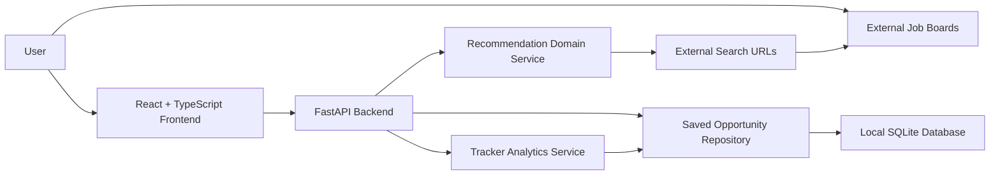
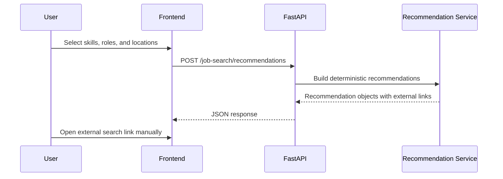
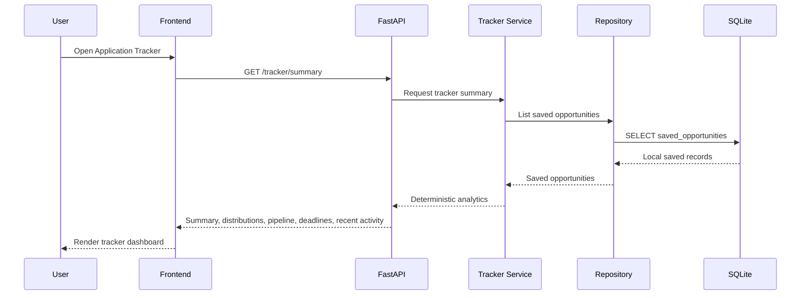
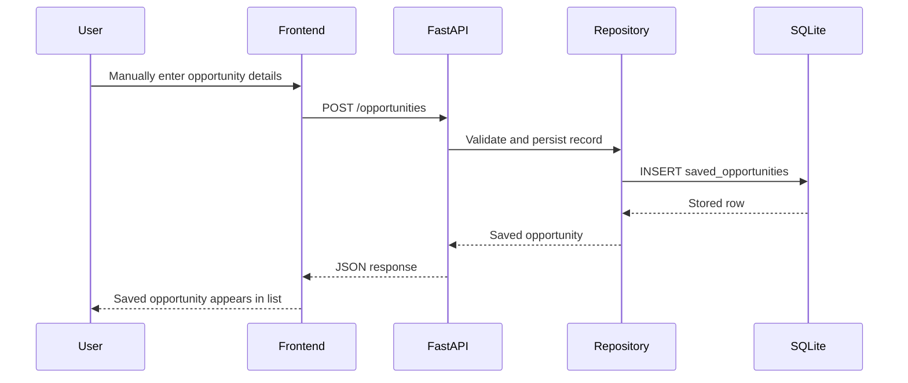

# System Architecture

## Overview

JobTrackr uses a full-stack architecture with a FastAPI backend and a React TypeScript frontend.

## Backend

The backend lives in `backend/src/jobtrackr_api`.

Current modules:

- `main.py` creates the FastAPI application and registers routers.
- `api/` contains HTTP route definitions.
- `models/` contains Pydantic request and response contracts.
- `persistence/` contains SQLite connection and table initialization helpers.
- `repositories/` contains database access logic for saved opportunities.
- `services/` contains deterministic business logic.

Current endpoints:

- `GET /health`
- `POST /job-search/recommendations`
- `POST /opportunities`
- `GET /opportunities`
- `GET /opportunities/{opportunity_id}`
- `PUT /opportunities/{opportunity_id}`
- `DELETE /opportunities/{opportunity_id}`
- `GET /tracker/summary`

## Frontend

The frontend lives in `frontend/src`.

Current modules:

- `App.tsx` registers React Router routes.
- `components/AppLayout.tsx` provides the responsive navigation shell and footer.
- `components/BrandLogo.tsx` renders the original JobTrackr logo asset.
- `components/FutureFeaturePage.tsx` powers honest future-feature pages.
- `main.tsx` mounts the React application.
- `pages/HomePage.tsx` renders the professional product home experience.
- `pages/DiscoverPage.tsx` calls the backend recommendation endpoint and renders external search links.
- `pages/SavedPage.tsx` renders the manual save workflow and saved opportunity management UI.
- `pages/TrackerPage.tsx` renders the functional tracker dashboard from saved opportunity analytics.
- `pages/ReportsPage.tsx` renders a polished future-feature preview with clearly labeled non-data skeletons.
- `styles.css` provides the brand system, layout, responsive rules, cards, buttons, badges, forms, and result states.
- `App.test.tsx` and page tests verify core product content and Discover Jobs behavior.

Current frontend routes:

- `/`
- `/discover`
- `/saved`
- `/tracker`
- `/reports`

## Recommendation Flow

## Data Persistence

JT-0003 introduces local SQLite persistence for saved opportunities. The default database path is `backend/data/jobtrackr.sqlite3`, which is ignored by Git because it is local runtime data.

The current persistence scope is intentionally narrow:

- Save user-entered opportunity records.
- List, filter, update, and delete saved opportunities.
- Keep records local to the developer machine.

No cloud database or authentication layer exists yet.

## Application Tracker Analytics

JT-0005 adds deterministic tracker analytics derived only from saved opportunities stored in SQLite.

The tracker service computes:

- Total opportunities.
- Active and closed opportunity counts.
- Counts for applied, interview, offer, rejected, upcoming deadline, and overdue states.
- Status, source, and priority distributions.
- Pipeline groups by saved opportunity status.
- Upcoming deadlines and overdue opportunities.
- Recently updated opportunities.

No analytics are generated from fake records, external job board scraping, or third-party APIs.

## Saved Opportunity Flow

## Safety Boundary

The system generates URLs only. It does not scrape pages, call private APIs, automate user sessions, or ingest third-party job listings.

JT-0002 keeps future pages honest. Saved Opportunities, Application Tracker, and Reports are visual foundations only until persistence and real user-entered data exist.

JT-0003 changes Saved Opportunities from placeholder to real local persistence. It still only stores information manually entered by the user.

JT-0004 changes the frontend presentation layer. It redesigns the product shell, Home, Discover Jobs, Saved Opportunities, Application Tracker, and Reports using the Stitch-inspired SaaS direction while preserving the backend contracts and no-scraping boundary.

JT-0005 changes Application Tracker from an honest future preview into a real dashboard. It only summarizes manually saved opportunities already stored in SQLite.

The backend CORS configuration allows the expected Vite development origin and adjacent Vite fallback ports for local development when the default frontend port is already occupied.
