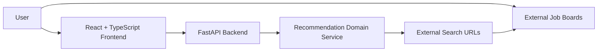
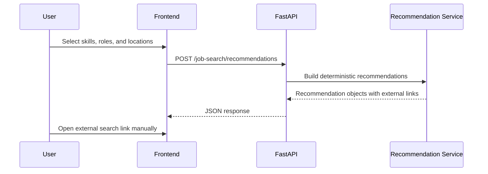

# System Architecture

## Overview

JobTrackr uses a full-stack architecture with a FastAPI backend and a React TypeScript frontend.

## Backend

The backend lives in `backend/src/jobtrackr_api`.

Current modules:

- `main.py` creates the FastAPI application and registers routers.
- `api/` contains HTTP route definitions.
- `models/` contains Pydantic request and response contracts.
- `services/` contains deterministic business logic.

Current endpoints:

- `GET /health`
- `POST /job-search/recommendations`

## Frontend

The frontend lives in `frontend/src`.

Current modules:

- `App.tsx` renders the initial portfolio-ready product screen.
- `main.tsx` mounts the React application.
- `styles.css` provides responsive presentation.
- `App.test.tsx` verifies core product content.

## Recommendation Flow

## Data Persistence

JT-0001 does not include a database. SQLite is planned for a later contract when manual opportunity saving and application status tracking are introduced.

## Safety Boundary

The system generates URLs only. It does not scrape pages, call private APIs, automate user sessions, or ingest third-party job listings.

