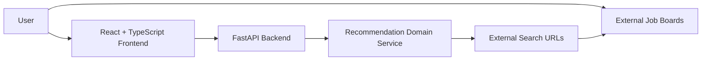
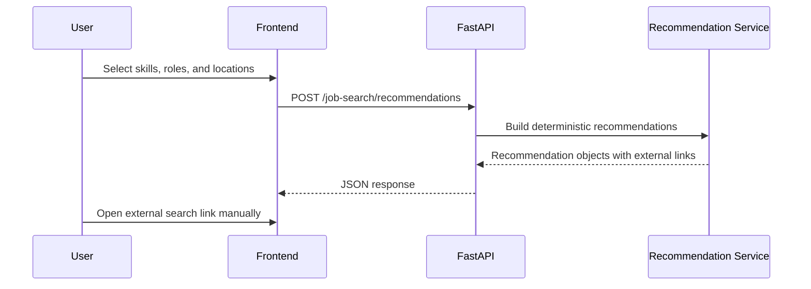

# System Architecture

## Overview

JobTrackr uses a full-stack architecture with a FastAPI backend and a React TypeScript frontend.

## Backend

The backend lives in `backend/src/jobtrackr_api`.

Current modules:

- `main.py` creates the FastAPI application and registers routers.
- `api/` contains HTTP route definitions.
- `models/` contains Pydantic request and response contracts.
- `services/` contains deterministic business logic.

Current endpoints:

- `GET /health`
- `POST /job-search/recommendations`

## Frontend

The frontend lives in `frontend/src`.

Current modules:

- `App.tsx` registers React Router routes.
- `components/AppLayout.tsx` provides the responsive navigation shell and footer.
- `components/BrandLogo.tsx` renders the original JobTrackr logo asset.
- `components/FutureFeaturePage.tsx` powers honest future-feature pages.
- `main.tsx` mounts the React application.
- `pages/HomePage.tsx` renders the professional product home experience.
- `pages/DiscoverPage.tsx` calls the backend recommendation endpoint and renders external search links.
- `pages/SavedPage.tsx`, `pages/TrackerPage.tsx`, and `pages/ReportsPage.tsx` render polished placeholders.
- `styles.css` provides the brand system, layout, responsive rules, cards, buttons, badges, forms, and result states.
- `App.test.tsx` and page tests verify core product content and Discover Jobs behavior.

Current frontend routes:

- `/`
- `/discover`
- `/saved`
- `/tracker`
- `/reports`

## Recommendation Flow

## Data Persistence

JT-0001 does not include a database. SQLite is planned for a later contract when manual opportunity saving and application status tracking are introduced.

## Safety Boundary

The system generates URLs only. It does not scrape pages, call private APIs, automate user sessions, or ingest third-party job listings.

JT-0002 keeps future pages honest. Saved Opportunities, Application Tracker, and Reports are visual foundations only until persistence and real user-entered data exist.
